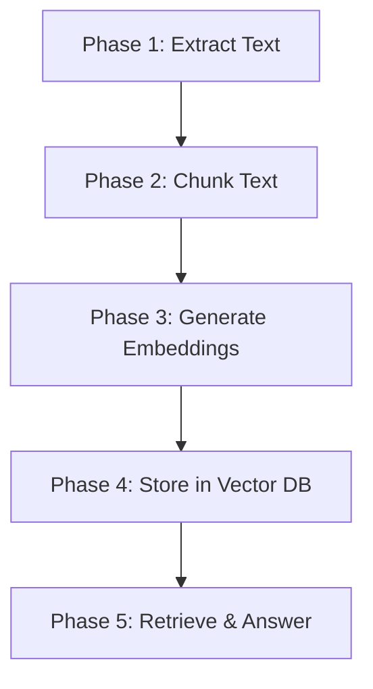

# Building a PDF Chatbot: Introduction & Setup

Welcome! If you are new to working with Large Language Models (LLMs) and building AI-powered applications, you are in the right place. 

In this project, you will build a **PDF Chatbot**. This is an application that lets you upload any PDF document (like a textbook, a research paper, or a manual) and ask questions about its content. Instead of guessing or searching through hundreds of pages manually, the chatbot will read the document, find the relevant sections, and write an accurate answer for you.

---

## 1. How Does a PDF Chatbot Actually Work?

At its heart, a PDF chatbot operates like an **open-book exam**. 

If you were asked to write an exam about a 200-page book you've never read, you wouldn't memorize the whole book on the spot. Instead, you would:
1. **Browse** the index or table of contents to find the exact pages relevant to the question.
2. **Read** those specific pages carefully.
3. **Write** your answer using the information from those pages.

A PDF chatbot does the exact same thing using a technique called **Retrieval-Augmented Generation (RAG)**:
* **Read (Extract):** The system extracts all the text from your PDF.
* **Find (Retrieve):** When you ask a question, the system searches the extracted text and pulls out only the sentences or paragraphs that are relevant to your question.
* **Answer (Generate):** The system passes those relevant paragraphs along with your question to a Large Language Model (LLM) like Gemini. The LLM reads the context and writes a natural, human-like response.

---

## 2. Why Can't We Just Paste the Whole PDF Into the LLM?

Modern LLMs are incredibly smart, so it is tempting to think we can just upload the entire PDF directly to the model and start asking questions. However, there are three major reasons why this doesn't work well in practice:

1. **Token Limits (Memory Capacity):** LLMs read text in chunks called "tokens" (which are roughly equivalent to partial words or characters). Every LLM has a limit on how many tokens it can process at one time. While some models have large limits, many cannot hold an entire book or a massive PDF in their active memory at once.
2. **Cost:** API providers (like Google or OpenAI) charge based on the number of tokens you send them. If you send a 100-page PDF every single time you ask a simple question, your costs will skyrocket immediately. By only sending the relevant pages, you keep costs extremely low.
3. **Accuracy & Speed:** The more text you give an LLM, the longer it takes to process. Furthermore, LLMs can suffer from a phenomenon known as "lost in the middle," where they miss key details buried deep inside a massive wall of text. Feeding the model only the exact paragraphs it needs keeps it fast and highly accurate.

---

## 3. The 5-Stage Pipeline You Will Build

You will build this project step-by-step, dividing the system into five clean phases:



### Phase 1: PDF Text Extraction
We will write Python code to read a PDF file and extract all of its raw text.

### Phase 2: Chunking (Splitting)
We will split the giant wall of text into smaller, overlapping snippets (e.g., 500 characters each). These smaller pieces are called **chunks**. Overlapping them ensures that no information or context is accidentally cut in half at the boundaries.

### Phase 3: Embedding (Mathematical Meaning)
Computers are bad at comparing raw text, but they are great at math. We will send each text chunk to Gemini's embedding model. The model translates the *meaning* of the text into a long list of numbers called an **embedding** (or vector). If two chunks talk about similar concepts (like "cats" and "kittens"), their embeddings will look very similar mathematically.

### Phase 4: Vector Storage (Database)
We will store all of our text chunks alongside their matching mathematical embeddings in a specialized database. This database is optimized for finding similar vectors quickly.

### Phase 5: Retrieval & Q&A Generation
When a user asks a question:
1. We convert their question into an embedding (vector).
2. We search our database to find the text chunks whose embeddings are closest to the question's embedding.
3. We take those top matching chunks, bundle them together with the user's question, and send them to the Gemini LLM.
4. Gemini reads the snippets and responds with the final answer.

---

## 4. Technical Stack

To build this project, we will use industry-standard tools that offer generous free tiers:

* **Google AI Studio (Gemini API):** We will use Google's free tier Gemini API for generating mathematical embeddings and for writing the final answers. You can get your free API key at [aistudio.google.com](https://aistudio.google.com/).
* **PostgreSQL Database with `pgvector`:** We will use a hosted PostgreSQL database (which you can set up for free on platforms like [Supabase](https://supabase.com) or [Neon](https://neon.tech)). Postgres is the most popular database in the world, and the `pgvector` extension allows it to store and search mathematical embeddings efficiently.

---

## 5. Environment Setup

Before starting, let's set up a clean, isolated environment on your computer.

### Step 1: Install Python
Make sure you have **Python 3.10** or higher installed. You can check your version by running:
```bash
python3 --version
```

### Step 2: Create a Virtual Environment (`venv`)
A virtual environment ensures that the libraries you install for this project do not interfere with other projects on your computer.
Create a virtual environment named `venv` in your project folder:
```bash
python3 -m venv venv
```

Activate the virtual environment:
* **On macOS/Linux:**
  ```bash
  source venv/bin/activate
  ```
* **On Windows:**
  ```cmd
  venv\Scripts\activate
  ```

Once activated, your terminal prompt will show `(venv)` at the beginning of the line.

### Step 3: Create a requirements.txt File
Create a [requirements.txt](file:///home/pulkit/projects/pdf_chatbot/requirements.txt) file in the root directory to track the libraries we need. We'll add standard packages for PDF parsing, database connection, and interacting with Gemini:

```text
google-generativeai
psycopg2-binary
python-dotenv
pypdf
```

Install the dependencies:
```bash
pip install -r requirements.txt
```

### Step 4: Create a .env File for API Keys
API keys and database credentials are secrets that should never be written directly in your code. Instead, we store them in a hidden file called [.env](file:///home/pulkit/projects/pdf_chatbot/.env).

Create a [.env](file:///home/pulkit/projects/pdf_chatbot/.env) file in the root of your project:
```env
GEMINI_API_KEY=your_gemini_api_key_here
DATABASE_URL=your_postgres_database_url_here
```

> [!WARNING]
> Never upload your `.env` file to public repositories like GitHub! We will configure a `.gitignore` file to make sure this file stays private on your local computer.

---

## 6. GitHub Integration & Passwordless Authentication

Now that your project environment is set up, you need to push your code to your remote GitHub repository. To avoid entering your username and password every time you push, we will set up **SSH Key Authentication** (which acts as a secure, automatic "passkey" for your command line).

> [!NOTE]
> GitHub does not allow you to use your regular account password for command-line Git operations. You must use either an **SSH Key** (recommended) or a **Personal Access Token**.

### Step 1: Create a `.gitignore` File
Before running any Git commands, we must tell Git to ignore files that are private (like [.env](file:///home/pulkit/projects/pdf_chatbot/.env)) or too large (like the `venv` folder).

Create a [.gitignore](file:///home/pulkit/projects/pdf_chatbot/.gitignore) file in the root of your project:
```git
# Environments
venv/
.env

# Python caching
__pycache__/
*.pyc

# Local databases / temp files
*.db
.DS_Store
```

### Step 2: Initialize Git Locally
If you haven't already, turn your project folder into a local Git repository and commit your files:
```bash
git init
git add .
git commit -m "Initial commit: setup environment and docs"
```

### Step 3: Set up Passwordless Authentication (SSH Key)
To push code without typing your credentials every time, we will generate an SSH Key and register it with GitHub.

1. **Generate a new SSH key** (press Enter to accept default file locations and passwords when prompted):
   ```bash
   ssh-keygen -t ed25519 -C "your_email@example.com"
   ```
2. **Start the SSH agent in the background**:
   ```bash
   eval "$(ssh-agent -s)"
   ```
3. **Add your new SSH private key to the agent**:
   ```bash
   ssh-add ~/.ssh/id_ed25519
   ```
4. **Copy the public key to your clipboard**:
   * **On macOS/Linux:**
     ```bash
     cat ~/.ssh/id_ed25519.pub
     ```
   * **On Windows:**
     ```cmd
     type %userprofile%\.ssh\id_ed25519.pub
     ```
   * *Copy the entire line that starts with `ssh-ed25519`.*
5. **Add the key to GitHub**:
   * Go to [github.com](https://github.com) and log in.
   * In the top-right corner, click your profile photo, then click **Settings**.
   * In the left sidebar, click **SSH and GPG keys**.
   * Click the green **New SSH key** button.
   * Give it a title (e.g., "My Laptop") and paste your public key into the **Key** field.
   * Click **Add SSH key**.

### Step 4: Link to GitHub and Push
Now, link your local repository to your remote GitHub repository. **Make sure to use the SSH URL format** (which starts with `git@github.com:`), not the HTTPS URL.

```bash
# Rename the default branch to 'main'
git branch -M main

# Link your local repo to GitHub (replace with your username and repo name)
git remote add origin git@github.com:your_username/your_repository_name.git

# Push your code to the 'main' branch on GitHub
git push -u origin main
```
*Note: If you have already set up a remote using HTTPS, you can change it to SSH using:*
```bash
git remote set-url origin git@github.com:your_username/your_repository_name.git
```

From now on, whenever you want to push updates, you simply run `git push`, and it will work automatically without asking for credentials!

---

## Learning Outcomes

By completing this introductory phase and preparing your workspace, you are now able to:
1. **Explain** the mechanics of Retrieval-Augmented Generation (RAG) using the "open-book exam" analogy.
2. **Defend** the choice of dividing a PDF into smaller chunks rather than feeding the entire file to an LLM.
3. **Outline** the 5 stages of an LLM search-and-retrieval pipeline.
4. **Configure** a Python virtual environment, package requirements, and environment variables safely.
5. **Publish** and sync your code to a remote GitHub repository using passwordless SSH keys.
