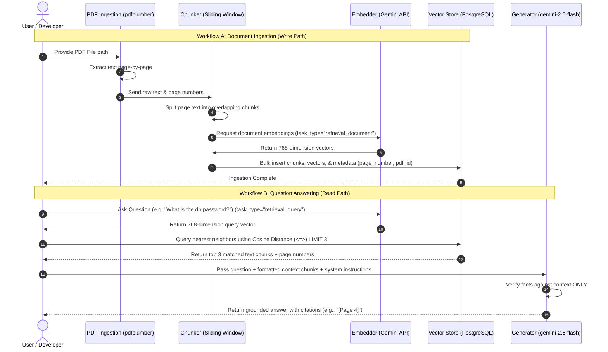

# Phase 5: LLM Integration and the End-to-End RAG Pipeline

In this final phase of our PDF Chatbot project, we tie all individual components together into a complete **Retrieval-Augmented Generation (RAG)** pipeline. We will connect the ingestion modules (text extraction, chunking, and embeddings) and retrieval storage (PostgreSQL/pgvector) with the **Google GenAI SDK** to generate accurate, context-grounded answers.

---

## 1. End-to-End System Architecture

The entire pipeline consists of two workflows: **Document Ingestion (write path)** and **Question Answering (read path)**.



---

## 2. Google GenAI SDK: Modern vs. Legacy Libraries

In this integration phase, we introduce the new **`google-genai`** SDK. It is important to distinguish this from the legacy library used in Phase 3.

| Feature | Legacy SDK (`google-generativeai`) | Modern SDK (`google-genai`) |
| :--- | :--- | :--- |
| **Import Statement** | `import google.generativeai as genai` | `from google import genai` |
| **Authentication** | `genai.configure(api_key="...")` (Global configuration) | `client = genai.Client(api_key="...")` (Client instance) |
| **Generation Call** | `model = genai.GenerativeModel(...)`<br>`response = model.generate_content(...)` | `response = client.models.generate_content(...)` |
| **Design Purpose** | Legacy library built specifically for early Gemini models. | Unified developer platform standardizing Gemini API calls across both Google AI Studio and Google Cloud Vertex AI. |

In our final `rag_chat.py` orchestrator, we use the modern `google-genai` SDK to interact with the generation model, ensuring forward compatibility with Google's latest models and standard API patterns.

---

## 3. The Unified API Key

You might wonder why we can use the same `GOOGLE_API_KEY` for both generating embeddings (Phase 3) and generating text answers (this phase).

Google AI Studio hosts both types of models under a unified API gateway:
1. **Representation Models:** e.g., `gemini-embedding-2`, which translates text strings into vector spaces.
2. **Generative Models:** e.g., `gemini-2.5-flash`, which processes text prompts to synthesize written text.

Because both endpoints are managed by Google AI Studio, a single API key authenticated against your Google developer account authorizes requests to any model in the catalog. This simplifies credential management by eliminating the need to set up separate accounts, credentials, or billing pipelines for different tasks in the same project.

---

## 4. Prompt Engineering & Reducing Hallucinations

**Hallucination** occurs when a Large Language Model invents facts that are not present in its context. To build a reliable document search chatbot, reducing hallucinations is our highest priority. We achieve this through four strict techniques:

### A. Context Grounding
By default, LLMs try to answer questions using their internal pre-training weights. We inject a strict system instruction overriding this behavior:
> *"Answer the question using ONLY the facts explicitly mentioned in the provided Context. Do NOT use any external or background knowledge."*
This instruction tells the model that its global knowledge is temporarily disabled, and the only "truth" in the universe is the text blocks we retrieved from our database.

### B. Safe Fallback
If an LLM does not know the answer, it tends to make up a plausible-sounding response. To prevent this, we instruct:
> *"If the answer cannot be determined or inferred from the provided Context, respond with: 'I'm sorry, but the provided context does not contain the answer to your question.'"*
This gives the model a clear exit path when the vector store fails to find relevant information.

### C. Forced Source Citations
We force the model to justify every claim:
> *"For every statement or claim you make in your answer, you MUST cite the source page number(s) in brackets (e.g., [Page X])."*
Requiring citations introduces an auditing mechanism. If the model cannot attribute a claim to a specific page number inside the injected context, the prompt instructions forbid generating that claim.

### D. Zero-Temperature Determinism
We set the model parameter `temperature = 0.0`. 
* **High temperature (e.g., 0.9):** Promotes creativity and diverse word choices. Excellent for creative writing but dangerous for factual Q&A.
* **Zero temperature (0.0):** Forces the model to select the tokens with the highest mathematical probability, making its answers deterministic, repetitive, and strictly bound to the literal meaning of the provided text.

---

## 5. Code Structure Overview

The complete RAG orchestrator is written in [rag_chat.py](file:///home/pulkit/projects/pdf_chatbot/src/chatbot/rag_chat.py). Below is a simplified review of the core pipeline logic:

### A. Document Ingestion Integration
```python
def ingest_pdf(pdf_path: str, pdf_id: str = None) -> None:
    # 1. Page-by-page text extraction
    pages = extract_text(pdf_path)
    
    chunks, embeddings, metadata = [], [], []
    for page in pages:
        if page["is_empty_or_scanned"]:
            continue
            
        # 2. Text chunking with sliding window
        page_chunks = chunk_text(page["text"])
        for chunk in page_chunks:
            # 3. Vector embedding using task_type="retrieval_document"
            emb = get_embedding(chunk, task_type="retrieval_document")
            chunks.append(chunk)
            embeddings.append(emb)
            metadata.append({"pdf_id": pdf_id, "page_number": page["page_number"]})
            
    # 4. Storage inside PostgreSQL
    store = VectorStore()
    store.store_chunks(chunks, embeddings, metadata)
```

### B. Query and Grounded Generation
```python
def answer_question(question: str) -> dict:
    # 1. Query embedding generation using task_type="retrieval_query"
    query_emb = get_embedding(question, task_type="retrieval_query")
    
    # 2. Nearest-neighbor vector similarity search
    store = VectorStore()
    results = store.search(query_emb, top_k=3)
    
    # 3. Prompt assembly and context loading
    context_text = format_context(results)
    
    # 4. Request Gemini 2.5 Flash using unified client
    response = client.models.generate_content(
        model="gemini-2.5-flash",
        contents=f"Context:\n{context_text}\n\nQuestion: {question}\n\nAnswer:",
        config=types.GenerateContentConfig(
            system_instruction=SYSTEM_INSTRUCTION,
            temperature=0.0
        )
    )
    return {"answer": response.text.strip(), "sources": extract_sources(results)}
```

---

## 6. How to Run the RAG Chatbot CLI

The orchestrator includes a command-line interface supporting ingestion and querying.

### A. Ingesting a PDF
To ingest a document (e.g., a syllabus or manual), run:
```bash
./venv/bin/python src/chatbot/rag_chat.py ingest /path/to/document.pdf --pdf-id "my_syllabus"
```

### B. Querying a Single Question
To test a single query:
```bash
./venv/bin/python src/chatbot/rag_chat.py query "When is the mid-term exam?"
```
*Output:*
```text
==================================================
QUESTION: When is the mid-term exam?
==================================================
ANSWER:
The mid-term exam will take place on October 12th in Room 304 [Page 2].
==================================================
CITED SOURCES:
 - Document: my_syllabus | Page: 2 | Similarity Score: 0.8412
==================================================
```

### C. Interactive Chat Mode
To start an ongoing terminal chat session:
```bash
./venv/bin/python src/chatbot/rag_chat.py chat
```

---

## Learning Outcomes

By completing Phase 5, you have learned how to:
1. **Synthesize** a full RAG pipeline end-to-end, combining file extraction, text chunking, embedding generation, databases, and LLM text generation.
2. **Contrast** the legacy `google-generativeai` package with the modern, unified `google-genai` SDK and use client-based authentication patterns.
3. **Formulate** prompt system instructions and constraints that prevent LLM hallucinations by anchoring generation models to custom contexts.
4. **Distinguish** embedding task types (`retrieval_document` vs `retrieval_query`) to maximize vector distance search relevance.
5. **Optimize** generative models using zero-temperature settings to yield deterministic, factual Q&A answers.
